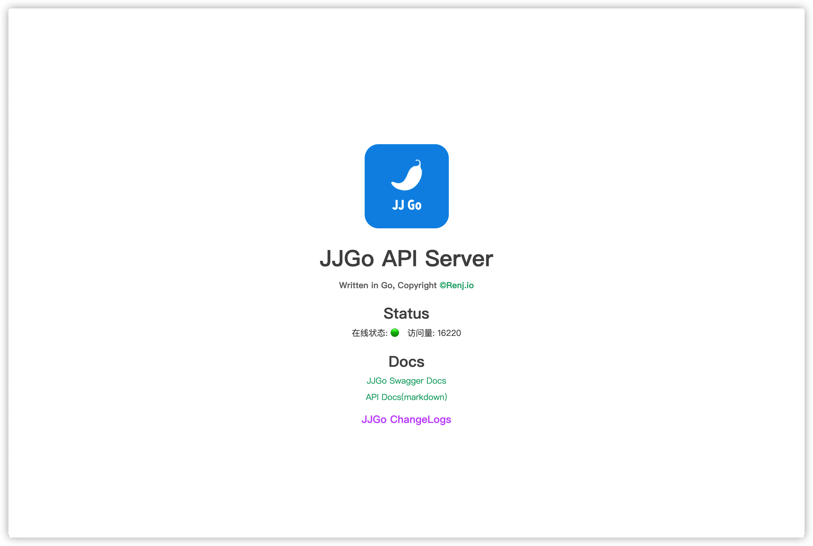
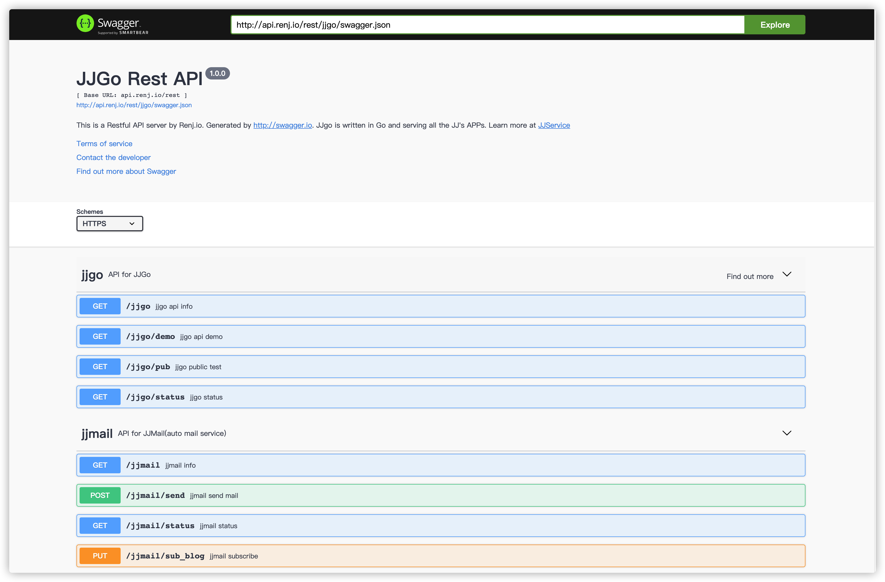

# JJGO

JJGo是一个高性能的Rest接口框架

支持cluster模式运行，开启多实例
支持多数据库同步



## 使用

```bash
Usage of ./app_jjgo:                                                                                         
  -c    清空jjgo日                                                                                           
  -e    修改jjgo配置                                                                                         
  -h    显示帮助信息                                                                                         
  -l    打印jjgo日志     行数                                                                                
  -r string                                                                                                  
        默认模式|全新模式|守(default "default")                                                              
  -s string                                                                                                  
        [start][stop][restart][reload][status]                                                               
  -v    显示jjgo版本
```

## JJGo API文档

## 接口列表

| 接口                    | 方法   | 描述         |
| ----------------------- | ------ | ------------ |
| /rest/jjgo/pub          | GET    | 公共测试     |
| /rest/jjgo/status       | GET    | JJGo状态信息 |
| /rest/jjgo/changelog    | GET    | 更新日志     |
| /rest/jjgo/version      | GET    | 版本信息     |
| /rest/jjgo/demo         | GET    | 演示接口     |
| /rest/jjgo/swagger.json | GET    | swagger接口  |
| /rest/jjmail/sub_blog   | PUT    | 订阅博客     |
| /rest/jjmail/sub_mgek   | PUT    | 订阅mgek     |
| /rest/jjmail/reply      | POST   | 自动回复邮件 |
| /rest/jjmail/unsub_blog | DELETE | 取消订阅     |
| /rest/jjmail/unsub_mgek | DELETE | 取消订阅     |

### JJGo接口

#### pub

| 接口      | 方式 | 描述     | 请求参数 |
| --------- | ---- | -------- | -------- |
| /jjgo/pub | GET  | 公共测试 | *        |

响应格式`JSON`

```json
{
    "code": 200,
    "data": {
        "client_ip": "127.0.0.1",
        "method": "GET",
        "host": "api.renj.io",
        "content_type": "JSON"
    },
    "msg": "Test for JJGo public",
    "time": "5ms"
}
```

#### status

| 接口         | 方式 | 描述     | 请求参数 |
| ------------ | ---- | -------- | -------- |
| /jjgo/status | GET  | 状态信息 | *        |

响应格式`JSON`

```json
{
    "code": 200,
    "data": {
        "pid": 11969,
        "port": 8022,
        "count": 100
    },
    "msg": "jjgo status",
    "time": "11ms"
}
```

#### changelog

| 接口            | 方式 | 描述     | 请求参数 |
| --------------- | ---- | -------- | -------- |
| /jjgo/changelog | GET  | 更新日志 | *        |

响应格式`JSON`

```json
{
    "code": 200,
    "data": [
        {
            "version": "1.0",
            "build": "2020-9-2",
            "description": "首个JJGo版本确定集成平台所有rest接口"
        },
        {
            "version": "1.2",
            "build": "2020-10-7",
            "description": "确定项目架构，设计外部库"
        },
        {
            "version": "1.3",
            "build": "2020-10-20",
            "description": "不使用React集成方式，直接在JJGo中渲染页面"
        },
        {
            "version": "1.4",
            "build": "2020-10-31",
            "description": "第一个上线版本，对接jjmail服务接口，使用信号监听完成服务的重启和启动操作"
        },
        {
            "version": "1.5",
            "build": "2020-11-2",
            "description": "添加jjlog程序操作日志，新增加密验证中间件支持header和params验证。解决命令参数在linux下控制台颜色错乱问题，优化重启逻辑支持热重载，支持集群模式启动"
        },
        {
            "version": "1.6",
            "build": "2020-11-4",
            "description": "解决日志循环引入问题"
        },
        {
            "version": "2.0",
            "build": "2020-11-10",
            "description": "数据库支持，新增API接口计数中间件，支持连接mysite数据库"
        }
    ],
    "msg": "jjgo change log",
    "time": "8ms"
}
```

#### version

| 接口          | 方式 | 描述     | 请求参数 |
| ------------- | ---- | -------- | -------- |
| /jjgo/version | GET  | 当前版本 | *        |

响应格式`JSON`

```json
{
    "code": 200,
    "data": {
        "version": "v2.0",
        "build_date": "2020-11-10",
        "jjcli": "v1.2",
        "jjlog": "v1.0",
        "api_server": "JJGo-API v2"
    },
    "msg": "jjgo Version",
    "time": "0ms"
}
```

#### demo

| 接口       | 方式 | 描述 | 请求参数 |
| ---------- | ---- | ---- | -------- |
| /jjgo/demo | GET  | 演示 | *        |

响应格式`JSON`

```json
{
    "code": 200,
    "data": {
        "rest": {
            "des": "restful接口",
            "path": "/rest/*"
        },
        "file": {
            "des": "静态文件接口",
            "path": "/swagger/*"
        },
        "html": {
            "des": "React前端页面",
            "path": "/*.html"
        }
    },
    "msg": "jjgo demo",
    "time": "5ms"
}
```

## swagger支持



## 更新日志

详见changelog.json

- 最新版 v2.0

- v2.1 修复数组越界 修正python脚本

    当前问题：jjmail的接口请求取消了jjauth校验，但是存在refer和host校验，取消订阅是不能正常返回的

